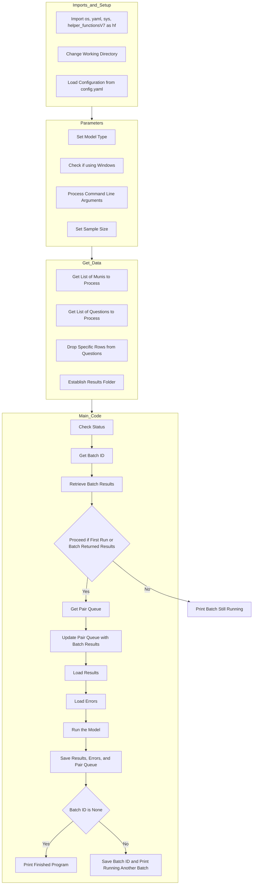
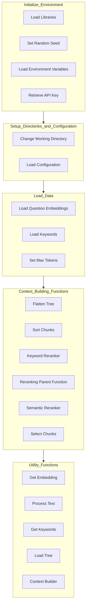

# AI Zoning Project

## Introduction
This GitHub repository hosts a project that utilizes Large Language Models (LLMs) to parse zoning documents. We introduce an innovative approach called generative regulatory measurement, which decodes and interprets statutes and administrative documents using LLMs for data collection and analysis. This tool constructs a detailed assessment of U.S. zoning regulations, estimating the correlation between these regulations, housing costs, and construction. Our work demonstrates the effectiveness and reliability of LLMs in measuring and interpreting complex regulatory datasets.

## Research Foundation
This project is based on the research paper "[The Costs of Housing Regulation: Evidence From Generative Regulatory Measurement](https://papers.ssrn.com/sol3/papers.cfm?abstract_id=4627587)" by Alexander Bartik, Arpit Gupta, and Daniel Milo. The paper provides the theoretical foundation and methodology used in this project.

## Installation and Setup

### Prerequisites
- **Python 3.8 or higher**: Ensure Python 3.8+ is installed on your system. You can check your Python version by running `python --version` or `python3 --version` in your terminal.

### Installation
1. **Clone the Repository**:
   Clone the project repository to your local machine using the following command:
   ```bash
   git clone https://github.com/RitulSoni/Ritul-Code-Task.git
   ```
2. **Navigate to the Project Directory**:
   Change into the project directory with:
   ```bash
   cd Ritul-Code-Task
   ```
3. **Install Dependencies**:
   Install the required Python libraries listed in `requirements.txt` using pip:
   ```bash
   pip3 install -r requirements.txt
   ```

### Configuration
1. **Create a `config.yaml` File**:
   You need to create a `config.yaml` file in the root directory of the project. This file should contain all necessary paths and API keys as per the structure below:

   Here is a basic template for `config.yaml`:
   ```yaml
   embeddings: path/to/your/embeddings
   raw_data: path/to/your/raw_data
   processed_data: path/to/your/processed_data
   muni_text: path/to/municipality/texts
   exllama_path: path/to/exllama/repository
   llama13b_path: path/to/llama13b/model
   llama70b_path: path/to/llama70b/model
   openai_key: your_openai_api_key_here
   num_neighbors: 5  # or any other appropriate number
   ```

2. To create embeddings and inference, we have to configure config.yaml for

| Key                 | Description                                                              |
|---------------------|--------------------------------------------------------------------------|
| `muni_text`         | Path where the raw text of all municipalities is stored.                 |
| `embeddings`        | Path where you want to store the embeddings.                             |
| `raw_data`          | Path where the questions are present.                                    |
| `exllama_path`      | Path of the cloned exllama repository if using Llama2.                   |
| `llama13b_path`     | Path where the Llama2 13B model is downloaded.                           |
| `llama70b_path`     | Path where the Llama2 70B model is downloaded.                           |
| `openai_key`        | OpenAI API key if you are using GPT.                                     |
| `processed_data`    | Path where you want to store the inference results.                      |
| `num_neighbors`     | Optional. Determines the number of chunks of text to include in the context. |

3. **Set up Environment Variables**:
   For additional security, especially with your API keys, consider using an `.env` file to store sensitive information such as your OpenAI key. Ensure that `.env` is included in your `.gitignore` file to prevent it from being committed to your version control system.

### Running the Project
Once the configuration is set up, you can run the project by executing the main script from the command line:
```bash
python3 QA_Code_V7.py
```

## Table of Contents
1. [QA_Code_V7.py](#qa_code_v7py)
2. [QuestionMuniPair.py](#questionmunipairpy)
3. [Helper_functionsV7.py](#helper_functionsv7py)
4. [Context_buildingv4.py](#context_buildingv4py)
5. [Gpt_functions.py](#gpt_functionspy)


## QA_Code_V7.py

### Overview
`QA_Code_V7.py` is the main script that runs the model. It manages the overall workflow, including setting up parameters, fetching data, and invoking the processing functions.

### Key Components
- **Configuration Loading**: Loads settings from `config.yaml`.
- **Munis and Questions**: Fetches the list of municipalities and questions to process.
- **Batch Processing**: Manages batching of requests to optimize API calls.
- **Main Execution**: Controls the flow of the script, ensuring proper sequence of operations.

### QA_Code_V7 Diagram

In the above diagram each block corresponds to a section of the script, showing how the code progresses through various stages of setup, data retrieval, and processing. 


## QuestionMuniPair.py

### Class: `QuestionMuniPair`

The `QuestionMuniPair` class is a core component of our project, responsible for managing the state and processing of question-municipality pairs. This class encapsulates the logic for handling questions about zoning regulations for specific municipalities and leverages large language models to generate and parse responses.

### Overview

The `QuestionMuniPair` class handles:
- Initialization of question-municipality pairs.
- Processing responses from language models.
- Managing the workflow states, including subtask processing, main question processing, and double-checking responses.

### Key Responsibilities

1. **Initialization**: Sets up the initial state with provided question, municipality, and model information.
2. **State Management**: Maintains and transitions between different states (e.g., subtasks, main processing, double-checking).
3. **Response Handling**: Processes responses from the language model, parses them, and aggregates results.
4. **Context Building**: Utilizes context-building functions to prepare the necessary context for language model queries.
5. **Cost Calculation**: Calculates the cost of API calls based on token usage.

### Key Methods

- **Initialization (`__init__`)**: Initializes the instance with question, municipality, and model details.
- **Processing (`process`)**: Orchestrates the processing flow, managing state transitions and response handling.
- **Response Handling (`process_response`, `response_main`, `response_subtasks`)**: Manages the processing and parsing of responses from the language model.
- **Subtask Management (`process_subtasks`)**: Handles the processing of subtasks associated with the main question.
- **Main Question Processing (`process_main`)**: Manages the processing of the main question, including context building and API requests.
- **Double-Checking (`process_double_check`)**: Implements a double-checking mechanism to validate responses when necessary.
- **Cost Calculation (`calc_cost`)**: Calculates the cost of API calls based on the number of tokens used.
- **Context and Prompt Creation (`create_question_openai_object`, `format_prompt`)**: Prepares and formats the context and prompts for API calls to the language model.

### Workflow Example

1. **Initialization**:
   ```python
   pair = QuestionMuniPair(question, municipality, model)
   ```

2. **Processing**:
   - The `process` method is called to start processing the question-municipality pair.
   - Depending on the state, it will either handle subtasks or the main question.

3. **Response Handling**:
   - After receiving a response from the language model, the `process_response` method parses and processes it.
   - If the response needs further validation, it transitions to the double-checking state.

4. **Final Response**:
   - Once all processing is complete, the `get_final_response` method is called to retrieve the aggregated result.

### Integration in Project

The `QuestionMuniPair` class is utilized within the main processing loop to handle each question-municipality pair, ensuring that responses are generated, parsed, and validated efficiently. It interacts with various helper functions and context-building modules to prepare the necessary inputs for language model queries and to manage the overall workflow.

### Example Code Snippet

```python
# Example of initializing and processing a QuestionMuniPair
pair = QuestionMuniPair(question, municipality, model)
pair.process()

# Get the final response after processing is complete
final_response = pair.get_final_response()
print(final_response)
```

### Conclusion

The `QuestionMuniPair` class is a crucial element of our project, streamlining the handling and processing of zoning-related questions for municipalities. By managing the state transitions and response parsing, it ensures that the project's workflow remains efficient and robust.


## Helper_functionsV7.py

### Overview
`Helper_functionsV7.py` includes a variety of utility functions that support the main script. These functions handle tasks such as loading data, managing files, and assisting with API interactions.

### Key Components
- **Data Loading**: Functions for loading question details, embeddings, and municipal data.
- **Batch Management**: Utilities for managing batch processes and tracking status.
- **Error Handling**: Functions for capturing and managing errors during processing.

## Helper Functions Overview

### Load and Save Functions

| Function Name       | Description                                                                                                                                                   |
|---------------------|---------------------------------------------------------------------------------------------------------------------------------------------------------------|
| `load_pair_queue`   | Loads the pair queue from a pickle file if it exists, otherwise creates a new queue with `QuestionMuniPair` instances for each question-municipality pair.    |
| `load_results`      | Loads the results from a pickle file if it exists, otherwise returns an empty list.                                                                            |
| `load_errors`       | Loads the errors from a pickle file if it exists, otherwise returns an empty list.                                                                             |
| `save_results`      | Saves the results to a pickle file.                                                                                                                            |
| `save_errors`       | Saves the errors to a pickle file.                                                                                                                             |
| `save_pair_queue`   | Saves the pair queue to a pickle file and updates the status check file. If the queue is empty, it deletes the pickle file.                                    |
| `load_batch_id`     | Loads the batch ID from a file.                                                                                                                                |
| `save_batch_id`     | Saves the batch ID to a file.                                                                                                                                  |

### Status and Utility Functions

| Function Name       | Description                                                                                                                                                   |
|---------------------|---------------------------------------------------------------------------------------------------------------------------------------------------------------|
| `check_status`      | Checks the status from a status check file, returning `True` if the file does not exist or the status is "True", otherwise returns `False`.                    |
| `flatten_batches`   | Flattens a list of lists into a single list.                                                                                                                   |
| `slurm_name`        | Generates a unique name based on SLURM task ID environment variables for naming files.                                                                         |

### Processing Functions

| Function Name       | Description                                                                                                                                                   |
|---------------------|---------------------------------------------------------------------------------------------------------------------------------------------------------------|
| `build_model`       | Processes the pair queue, builds batches, and manages the process of creating API calls for model completions.                                                 |
| `retrieve_batch`    | Retrieves the results of a batch of API calls from a file or directly from the API, depending on the `fake_batch` flag.                                        |
| `generate_real_response` | Simulates real API responses by generating completions for each request in a batch.                                                                            |
| `update_pairs`      | Updates the pair queue with the results from a batch of API calls.                                                                                            |

### Token and Question Functions

| Function Name                      | Description                                                                                                                                                   |
|------------------------------------|---------------------------------------------------------------------------------------------------------------------------------------------------------------|
| `load_or_fetch_question_details`   | Loads question details from a text file if it exists, otherwise fetches the details using a hypothetical function and stores them in a text file.              |
| `get_token_count`                  | Calculates the token count for an OpenAI object by encoding the messages using the appropriate tokenizer.                                                      |

### Municipality Functions

| Function Name                   | Description                                                                                                                                                   |
|---------------------------------|---------------------------------------------------------------------------------------------------------------------------------------------------------------|
| `get_munis`                     | Retrieves the list of municipalities to process, filtering and splitting them based on training/testing type and parallelization requirements.                |
| `split_munis_across_nodes`      | Splits the list of municipalities across multiple nodes for parallel processing based on SLURM environment variables.                                          |
| `filter_pioneer`                | Filters the list of municipalities to include only those in the training, testing, or Wharton dataset.                                                         |
| `filter_muni_list_by_files`     | Filters the list of municipalities to include only those that have corresponding .pkl files in a specified directory.                                          |


## Context_buildingv4.py

### Overview
`Context_buildingv4.py` is responsible for building the context that the language model sees from Retrieval-Augmented Generation (RAG). This context is critical for ensuring the model has all necessary information to provide accurate answers.

### Key Components
- **Tree Flattening**: Converts hierarchical data structures into flat lists.
- **Chunk Sorting**: Sorts text chunks based on relevance using cosine similarity.
- **Context Selection**: Selects and combines relevant text chunks to form the final context.

### Context_Building Diagram



## Gpt_functions.py

### Overview
`Gpt_functions.py` encapsulates all interactions with the OpenAI API. This includes functions for making API calls, uploading data, and retrieving results.

### Key Components
- **API Calls**: Functions for generating completions, embeddings, and managing files.
- **Batch Management**: Functions for creating, retrieving, and managing batches of API requests.
- **Embedding Management**: Utilities for working with text embeddings.

### Flow Diagram


## Contributing
1. Fork the repository.
2. Create a new branch (`git checkout -b feature-branch`).
3. Commit your changes (`git commit -am 'Add new feature'`).
4. Push to the branch (`git push origin feature-branch`).
5. Open a pull request.

## Authors
- **Alexander Bartik**  
  University of Illinois at Urbana-Champaign - Department of Economics

- **Arpit Gupta**  
  NYU Stern School of Business

- **Daniel Milo**  
  New York University


## Conclusion
This guide provides a comprehensive overview of the Zoning AI project, detailing each major component and their roles within the system. By following the installation and setup instructions, you can get the project up and running, and start contributing to its development.

---

## License
This project is licensed under the MIT License. See the `LICENSE` file for details.